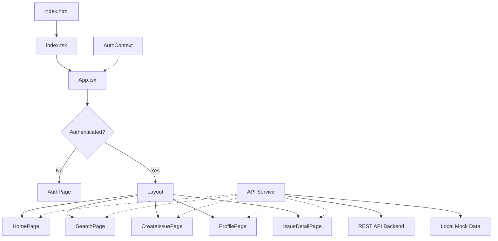

<div align="center">

# 🏙️ Civic Resolve

### Report & Resolve Community Issues

A modern civic issue reporting platform that empowers citizens to report local problems — potholes, broken streetlights, overflowing trash — and enables authorities to track and resolve them transparently.

[](https://react.dev/)
[](https://www.typescriptlang.org/)
[](https://vite.dev/)
[](https://tailwindcss.com/)

</div>

---

## ✨ Features

### 🧑‍💼 For Citizens
- **Report Issues** — Submit reports with title, description, tags, photo evidence, and auto-captured GPS location
- **Photo Capture** — Take photos directly from your camera or upload from gallery
- **Geolocation** — Automatic location tagging for accurate issue mapping
- **Upvote & Repost** — Boost visibility of important issues in the community
- **Search & Filter** — Find issues by keyword, tag, or status (Pending / In Progress / Resolved)
- **Trending Topics** — See the most-reported tags at a glance
- **User Profiles** — View your reported issues, stats, and activity history

### 🏛️ For Authorities
- **Issue Management** — Update issue status with comments and resolution notes
- **Status Workflow** — Move issues through Pending → In Progress → Resolved
- **Update History** — Full audit trail of all status changes and comments
- **Dashboard** — View and manage all issues assigned or updated by you

### 🔐 Authentication & Verification
- **Multi-step Registration** — Username, email, mobile, Aadhaar verification
- **Email & Mobile OTP** — Two-factor verification during signup
- **Aadhaar Verification** — Identity validation against Aadhaar database
- **Role-based Access** — Separate Citizen and Authority roles with different capabilities
- **JWT Authentication** — Secure login with token-based session management

### 📱 Responsive Design
- **Desktop** — Full sidebar navigation with user profile panel
- **Mobile** — Bottom navigation bar with collapsible header
- **Dark Theme** — Sleek dark UI with teal accent colors

---

## 🛠️ Tech Stack

| Layer | Technology |
|-------|-----------|
| **Frontend Framework** | React 19 with TypeScript |
| **Build Tool** | Vite 6 |
| **Routing** | React Router DOM 7 |
| **Styling** | Tailwind CSS 4 |
| **HTTP Client** | Axios |
| **State Management** | React Context API |
| **Backend API** | REST API (localhost:1947) |

---

## 📁 Project Structure

```
civic-issue-reporting-system/
├── index.html                # App entry point with Tailwind config
├── index.tsx                 # React root render
├── index.css                 # Global styles
├── types.ts                  # TypeScript type definitions (User, Issue, IssueUpdate)
├── constants.tsx             # SVG icon components & dummy seed data
├── vite.config.ts            # Vite build configuration with path aliases
├── tsconfig.json             # TypeScript configuration
├── package.json              # Dependencies & scripts
├── metadata.json             # App metadata & permissions
│
├── components/
│   ├── App.tsx               # Root component with routing & auth guards
│   ├── Layout.tsx            # Responsive layout (sidebar + mobile nav)
│   ├── IssueCard.tsx         # Issue feed card component
│   ├── StatusBar.tsx         # Visual status indicator (Pending/InProgress/Resolved)
│   ├── CameraCapture.tsx     # Camera integration component
│   └── ui.tsx                # Reusable UI primitives (Button, Input, Card, etc.)
│
├── pages/
│   ├── HomePage.tsx          # Issue feed with trending topics sidebar
│   ├── SearchPage.tsx        # Search & filter issues with popular tags
│   ├── CreateIssuePage.tsx   # Report new issue form with photo & location
│   ├── ProfilePage.tsx       # User profile with stats & issue history
│   └── AuthPage.tsx          # Login & multi-step registration
│
├── context/
│   └── AuthContext.tsx       # Authentication state & user session management
│
├── services/
│   └── api.ts                # API service layer (REST + local mock fallbacks)
│
└── IssueDetailPage.tsx       # Individual issue view with updates & authority controls
```

---

## 🚀 Getting Started

### Prerequisites

- **Node.js** ≥ 18
- **npm** ≥ 9

### Installation

1. **Clone the repository**
   ```bash
   git clone https://github.com/geniusjoelraj/civic-issue-reporting-system.git
   cd civic-issue-reporting-system
   ```

2. **Install dependencies**
   ```bash
   npm install
   ```

3. **Configure environment** (optional)

   Create a `.env.local` file in the project root:
   ```env
   GEMINI_API_KEY=your_api_key_here
   ```

4. **Start the development server**
   ```bash
   npm run dev
   ```

5. Open your browser at **http://localhost:5173**

### Build for Production

```bash
npm run build
npm run preview
```

---

## 🔑 Demo Credentials

The app includes mock data for testing. You can register a new account using the multi-step flow, or use existing test data:

| Field | Test Value |
|-------|-----------|
| **Aadhaar Numbers** | `123456789012`, `210987654321`, `112233445566` |
| **Email OTP** | `123456` |
| **Mobile OTP** | `999999` |

---

## 🏗️ Architecture



### Key Patterns

- **Protected Routes** — All pages except `/auth` require authentication; unauthenticated users are redirected to login
- **Role-based UI** — Authority users see issue management controls; Citizens see reporting tools
- **Hybrid Data Layer** — API service falls back to local mock data when the backend is unavailable
- **Context-based Auth** — `AuthContext` provides user state, login/logout, and session persistence via `localStorage`

---
